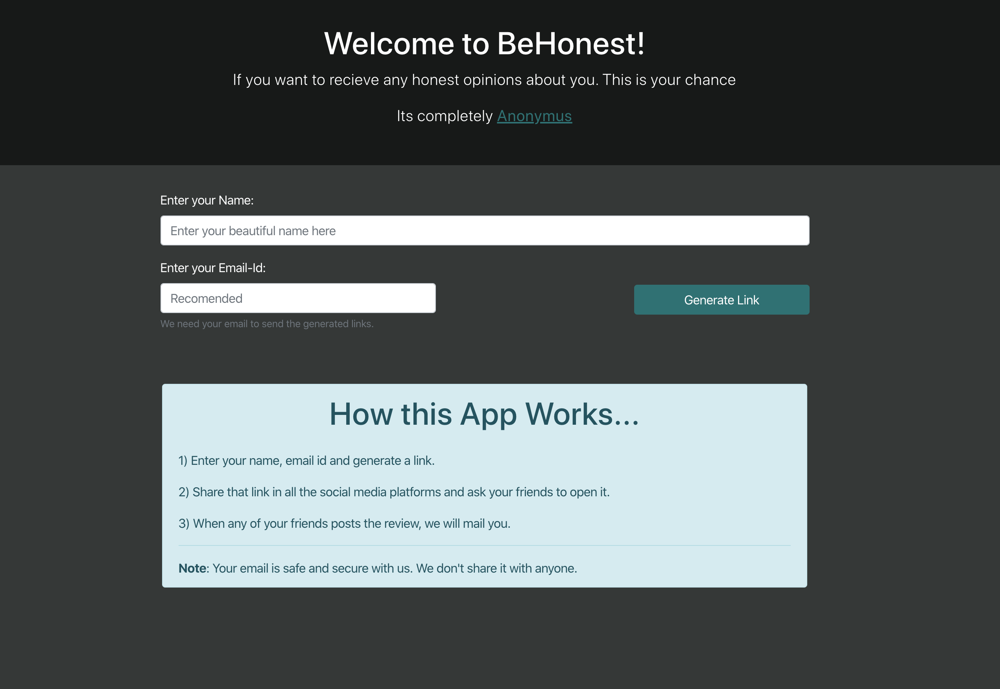

# Be-Honest

A web page to ask and recieve honest reviews about you.

## Implementation Details

The website is completely built on JavaScript.

### Server:

- I had used express-js with mysql as database

### Client:

- For JS, To make it fast, I had used React JS Library.
- For CSS, I had used Bootstrap Library.
  - I had implemented few new classes for unique design of this site.
  - There is only one .css file for the entire codebase.

### Just For Fun:

- Used `var` in all the codebase (expect on React Pure Components).
- Used ES5 export syntax structure on server apis.
